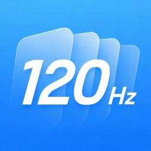
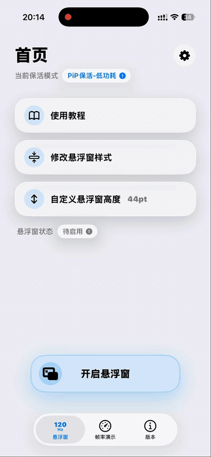

  

# 全局高刷悬浮窗

> 基于 [CaiWanFeng/PiP](https://github.com/CaiWanFeng/PiP) 修改的个人学习与测试版本。

全局高刷通过系统画中画悬浮窗辅助部分 iOS App 恢复更高的自适应刷新率表现1-120Hz。将悬浮窗拖动并吸附到屏幕侧边后，可用于改善部分被限制在 1-80Hz 的场景体验。

## 说明

本项目是在原版 PiP 示例基础上继续开发的修改版，原作者为 CaiWanFeng。当前版本由 Yoroin 完善，主要增加了后台保活、悬浮窗高度调节（可完全隐藏悬浮窗）、iOS 26 液态玻璃 UI 适配、低版本 iOS 兼容处理和调试日志功能。

请注意：

- 本项目仅用于学习、研究和个人设备测试。
- 效果依赖系统画中画、设备刷新率能力和具体 App 的刷新率策略。
- 60Hz 设备或本身锁定 60Hz 的 App 无法通过本项目变成 120Hz。
- 后台保活并非系统级永久后台权限，仍可能受到内存压力、系统策略或其他画中画 App 的影响。

## 主要功能

- 悬浮窗后台保活
- 自定义悬浮窗高度，最低支持 0.1pt
- 支持调节侧边吸附框大小
- 支持开启/停止悬浮窗内容滚动
- 支持记忆悬浮窗高度
- 帧率演示页面，用于对比 80Hz 和 120Hz 滑动体验
- 使用教程与常见问题页面
- iOS 26 液态玻璃风格适配
- 旧版 iOS 使用高斯模糊风格适配
- iOS 15 / iOS 16 低版本兼容优化
- 调试模式，可复制最近运行日志用于反馈问题

## 使用方式

1. 打开 App，点击首页的“开启悬浮窗”按钮。
2. 将悬浮窗拖动到屏幕侧边并吸附。
3. 如需隐藏悬浮窗，可在开启后将悬浮窗高度调节至 0.1pt。
4. 如遇问题，可在“关于”页点击“常见问题”右侧的工具按钮，打开调试模式后复制调试日志。

## 自签安装

项目导出的通用未签名 IPA 可通过以下工具自行签名安装：

- 牛蛙助手
- AltStore
- Sideloadly
- TrollStore 等其他支持自签的工具

请使用自己的 Apple ID、证书或设备环境完成签名安装。

## 版本日志

### 1.0.0（26.5.26）

- 在原版基础上增加后台保活功能和修改悬浮窗大小

### 1.0.1（26.5.27）

- 去除旋转窗口功能
- 增加自定义悬浮窗高度功能，可通过滑块无级调节
- 增加关闭/开启滚动功能

### 1.0.2（26.6.3）

- 调整自定义悬浮窗的最低值为0.1pt，可以做到完全隐藏悬浮窗

### 1.0.3（26.6.4）

- 对“滚动悬浮窗”增加默认记忆功能；首页新增 记忆悬浮窗高度 开关
- 尝试修复iOS16低版本无法打开悬浮窗的问题

### 1.0.4（26.6.4）

- 修复低版本iOS设备闪退问题，已在iOS15.8设备调试通过

### 1.0.5（26.6.6）

- 修复iOS16部分用户卡顿的问题，修复iOS16部分用户相机可能导致的闪退问题以及自定义悬浮窗高度不生效的问题（感谢两位老铁的崩溃日志和测试）
- 修复部分用户反馈的音频冲突问题
- 优化旧版iOS系统的UI，未适配液态玻璃的组件采用高斯模糊

### 1.0.6（26.6.6）

- 调试模式新增 保活方案切换 开关，可尝试切换为更省电的仅PiP保活方案，但后台留存率可能下降可能出现低版本兼容性问题，可自行选择
- 修复关闭悬浮窗后进入后台可能自动重新开启的问题
- 调试模式新增复制诊断日志功能，用于辅助排查耗电变化和推断后台保活中断时间段

### 1.0.7（26.6.8）

- 为了减少耗电量，经过实测对比后APP将默认启用为更为省电的仅PiP保活新方案，后台保活效果仍为显著，且解决了小部分场景下的音频冲突问题
- 可通过版本号-下方或首页查看当前保活模式
- 不再推荐使用老方案，如有需求可再自行前往调试模式-自由切换
- 首页新增悬浮窗状态检测，方便查看是否生效以及隐藏和是否被杀后台，点击可查看每次打开后的持续运行时间以及上次关闭时间，便于判断后台留存时间
- 首页停止滚动按钮移至二级菜单，防止误解

## 调试日志

关于页提供“调试模式”开关。开启后可以复制最近运行日志，方便定位：

- 悬浮窗是否成功准备
- 系统是否允许开启画中画
- 前后台保活状态
- 音频中断与恢复
- 低版本 iOS 兼容分支状态

日志仅保存在本机，不会联网上传。用户主动点击复制后，才会写入剪贴板。

## 致谢与署名

本项目基于 [CaiWanFeng/PiP](https://github.com/CaiWanFeng/PiP) 修改开发，感谢原作者 CaiWanFeng 提供原始 PiP 示例。

- 原项目：[CaiWanFeng/PiP](https://github.com/CaiWanFeng/PiP)
- 原作者：CaiWanFeng
- 当前项目：[Yoroin/GlobalRefresh-PiP](https://github.com/Yoroin/GlobalRefresh-PiP)
- 当前修改版维护：Yoroin

如果基于本项目继续修改、分发或发布 App，请保留原作者 CaiWanFeng、当前修改版 Yoroin 以及对应项目地址。请勿将本项目或其修改版声称为完全原创作品。

## 免责声明

本项目仅供学习和个人测试使用。使用者需要自行承担安装、签名、使用过程中的风险。请勿将本项目用于违反平台规则、商业侵权或其他不当用途。
