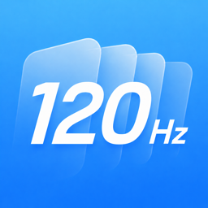
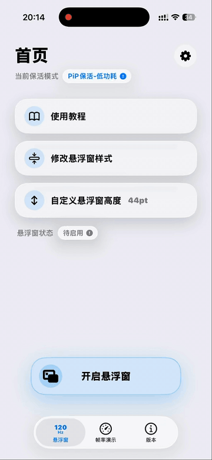

<p align="center">
  
</p>

# Global Refresh PiP

[Simplified Chinese](README.md) | **English**

> A personal learning and testing fork based on [CaiWanFeng/PiP](https://github.com/CaiWanFeng/PiP).

Global Refresh uses the system Picture in Picture floating window to help some iOS apps regain higher adaptive refresh-rate behavior, from 1 Hz to 120 Hz. After docking the floating window to the side of the screen, it can improve some scenes that are otherwise limited to 1-80 Hz.

## Overview

This project continues development on top of the original PiP sample by CaiWanFeng. The current version is maintained by Yoroin and mainly adds background keep-alive, adjustable floating-window height, near-invisible PiP height, iOS 26 Liquid Glass-style UI adaptation, older iOS compatibility handling, and diagnostic logging.

Please note:

- This project is intended only for learning, research, and personal-device testing.
- The effect depends on system Picture in Picture behavior, device refresh-rate capability, and each app's own refresh-rate policy.
- A 60 Hz device, or an app that is strictly locked to 60 Hz, cannot become 120 Hz just because of this project.
- Background keep-alive is not a permanent system-level background permission. It may still be affected by memory pressure, system policy, or other PiP apps.

Engine route notes:

| Route | Advantages | Limitations | Recommended Use |
| --- | --- | --- | --- |
| Default: VideoCall | Supports a minimum height of 0.1 pt and can be visually hidden; better compatibility; more stable for daily use | Forces system-wide 120 Hz, so some games or danmaku scenes locked to 60 Hz may stutter because of refresh-rate mismatch | Most apps, 80 Hz locked scenes, and users who need the floating window to fully hide |
| New: PlayerLayer | Can improve stutter caused by some 60 Hz locked apps becoming unsynchronized with 120 Hz, such as Bilibili danmaku speed fluctuation or occasional Brawl Stars lobby drops | Limited by the underlying route to a minimum of 1 pt, so it cannot fully hide and may leave a thin visible line; this is a testing entry | Only try this route when you encounter 60 Hz locked scene stutter |

In short: the default route hides better and is recommended for most users. The new route is mainly for specific 60 Hz locked stutter cases, but it cannot fully hide at 0.1 pt.

## Features

- PiP background keep-alive
- Custom floating-window height, down to 0.1 pt
- Adjustable side-docked floating-window size
- Start or stop floating-window text scrolling
- Remember floating-window height
- Frame-rate demo page for comparing 80 Hz and 120 Hz behavior
- Tutorial and FAQ pages
- iOS 26 Liquid Glass-style UI adaptation
- Blur-style fallback UI for older iOS versions
- iOS 15 / iOS 16 compatibility improvements
- Debug mode for copying recent diagnostic logs when reporting issues

## Usage

1. Open the app and tap "Enable PiP" on the home page.
2. Drag the floating window to the side of the screen until it docks.
3. To hide the floating window, adjust its height to 0.1 pt after it starts.
4. If you run into issues, open Debug Mode from the About/FAQ tools and copy the diagnostic log.



## Developer Notes

If you only want to use the default `VideoCall` route to implement a custom-height Picture in Picture floating window, and do not need this project's forced 120 Hz behavior, keep the `AVPictureInPictureVideoCallViewController` + `AVPictureInPictureController.ContentSource` route.

The basic idea is to create a transparent `AVPictureInPictureVideoCallViewController`, use `preferredContentSize` to control the floating-window size, and attach your custom view inside the content view:

```swift
let contentController = AVPictureInPictureVideoCallViewController()
contentController.preferredContentSize = CGSize(width: 300, height: customHeight)
contentController.view.backgroundColor = .clear
contentController.view.isOpaque = false

let contentSource = AVPictureInPictureController.ContentSource(
    activeVideoCallSourceView: sourceView,
    contentViewController: contentController
)

let pipController = AVPictureInPictureController(contentSource: contentSource)
```

When changing the height later, update both `preferredContentSize` and your custom view constraints. If you need visual hiding, you can reduce the height to a very small value such as `0.1 pt`; otherwise, use a more conservative height.

If you do not need forced 120 Hz, avoid copying this project's high-refresh driver fields:

- Do not enable `CADisableMinimumFrameDurationOnPhone` in `Info.plist`
- Do not pin `CADisplayLink.preferredFrameRateRange` to `minimum = maximum = preferred = 120`
- Do not pin `preferredFramesPerSecond` to `120`
- If you still need a DisplayLink, let the system adapt, for example:

```swift
if #available(iOS 15.0, *) {
    displayLink.preferredFrameRateRange = CAFrameRateRange(
        minimum: 30,
        maximum: Float(UIScreen.main.maximumFramesPerSecond),
        preferred: 0
    )
} else {
    displayLink.preferredFramesPerSecond = 0
}
```

In short: for custom height only, keep the `VideoCall` PiP container and `preferredContentSize`, and remove the forced 120 Hz fields so the system can decide the refresh rate.

## Self-Signing

The exported unsigned IPA can be signed and installed with tools such as:

- Bullfrog Assistant
- AltStore
- Sideloadly
- TrollStore
- Other sideloading or self-signing tools

Use your own Apple ID, certificate, or device environment to sign and install the app.

## Changelog

### 1.0.9 (2026.7.8)

- Rolled the high-refresh driver fields back to the stable 1.0.7 behavior, fixing 120 Hz unlock failures on some iOS versions.
- Added an engine switch testing entry. It can improve Bilibili danmaku and Brawl Stars stutter caused by some 60 Hz locked scenes becoming unsynchronized with 120 Hz. The new route cannot fully hide and has a 1 pt minimum; the default VideoCall route still supports 0.1 pt hiding.
- Added the home-page "One-tap 0.1 pt" button for quickly adjusting height after the floating window is docked.
- Optimized floating-window components to avoid two white dots at 0.1 pt. This only applies to iOS 16+.
- Reduced resource usage after hiding: text scrolling and clock refresh pause at 0.1 pt to reduce unnecessary long-running background work and heat.
- Removed the Background Interruption Alert beta feature to reduce false positives.
- Improved dark-mode switching logic and moved the button to the home page.
- Added lower-iOS Shortcut compatibility attempts. If Shortcuts do not work, use More Settings > Manual Shortcut Import.
- Added English localization.
- Simplified Debug Mode. When Debug Mode is off, logging stops completely to reduce performance overhead.
- Improved frame-rate detection logic and some animation details.
- Enabled the original text floating window, PiP conflict alert, persistent PiP status, and remembered PiP height by default.
- Added manual height input.
- Known issue: using a Shortcut to open and hide PiP in one step may leave the floating window undocked, which can prevent auto-lock. It is generally recommended to enable PiP first, drag it to the side until it docks, then tap "One-tap 0.1 pt".

## Debug Logs

The About page provides a Debug Mode switch. When enabled, it can copy recent diagnostic logs for checking:

- Whether PiP was prepared successfully
- Whether the system allows Picture in Picture
- Foreground/background keep-alive state
- Audio interruptions and recovery
- Compatibility branches for older iOS versions

Logs are stored locally only. They are copied to the clipboard only after the user taps the copy button.

## Credits

This project is based on [CaiWanFeng/PiP](https://github.com/CaiWanFeng/PiP). Thanks to CaiWanFeng for the original PiP sample.

- Original project: [CaiWanFeng/PiP](https://github.com/CaiWanFeng/PiP)
- Original author: CaiWanFeng
- Current project: [Yoroin/GlobalRefresh-PiP](https://github.com/Yoroin/GlobalRefresh-PiP)
- Current modified version maintained by: Yoroin

If you modify, redistribute, or publish an app based on this project, please keep the credits for CaiWanFeng, Yoroin, and the related project links. Do not claim this project or a modified version as a completely original work.

## Disclaimer

This project is provided only for learning and personal testing. Users are responsible for the risks involved in installation, signing, and use. Do not use this project for platform-rule violations, commercial infringement, or other improper purposes.
