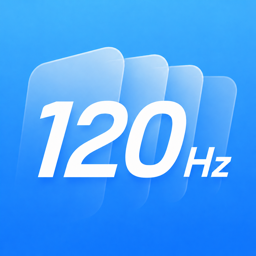
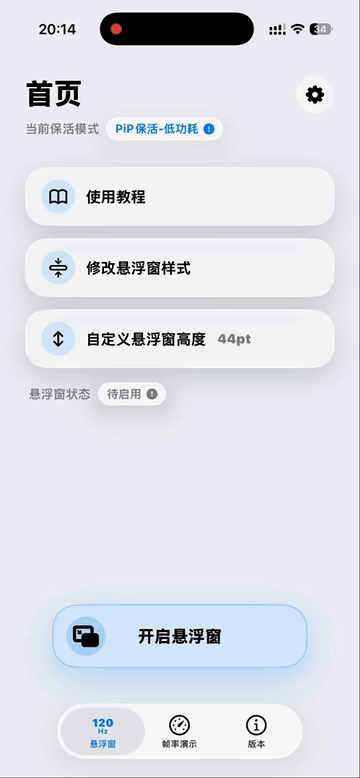

<p align="center">
  
</p>

# Global Refresh PiP

<h3>
  <a href="README.md">Simplified Chinese</a> | English | <a href="DEVELOPMENT_PRD.md">开发文档 PRD</a> | <a href="DEVELOPMENT_PRD_EN.md">Development Document PRD</a>
</h3>

> Continued development based on [CaiWanFeng/PiP](https://github.com/CaiWanFeng/PiP), maintained by [Yoroin](http://www.coolapk.com/u/3233328).

Adds background keep-alive, a fully hidden floating window, and protection for coexistence with other Picture in Picture windows. An active PiP window can help supported ProMotion devices and some apps normally limited to around 80Hz reach adaptive refresh rates of up to 120Hz. Supports iOS 15–27.

Version 1.1.1 updates the default VideoCall implementation: it keeps PiP content updating without the previous fixed 120Hz request in the floating-window driver. This addresses stuttering in some 60fps games and Bilibili comments, and improves automatic screen locking with a directly hidden window.

The default VideoCall + PiP-only combination supports starting directly at 0.1pt and adds floating-window coexistence protection: it can keep running alongside another app's PiP instead of being displaced or interrupted, avoiding repeated manual restarts. This protection targets competition from other PiP windows, not termination caused by memory pressure or system policies; compatibility still depends on iOS and the other app. PlayerLayer remains a compatibility alternative with a minimum height of 1pt and is no longer the first recommendation for those stuttering issues.

Actual refresh rate, coexistence and background lifetime depend on the device, iOS, the foreground app and available resources. This is not a fixed 120Hz mode or permanent background permission, and cannot turn a 60Hz display or fixed 60fps content into 120fps.

## Overview

This project continues development on top of the original PiP sample by CaiWanFeng. The current version is maintained by Yoroin and focuses on:

- custom-height iOS Picture-in-Picture overlays
- near-invisible docked PiP windows
- PiP-based background keep-alive experiments
- ProMotion refresh-rate behavior testing
- VideoCall and PlayerLayer PiP route comparison
- iOS 15+ compatibility and iOS 26-style UI adaptation
- diagnostic logging for PiP, background state, and frame-rate behavior

Please note:

- This project is intended only for learning, research, and personal-device testing.
- The effect depends on system Picture in Picture behavior, device refresh-rate capability, and each app's own refresh-rate policy.
- A 60 Hz device, or an app that is strictly locked to 60 Hz, cannot become 120 Hz just because of this project.
- Background keep-alive is not a permanent system-level background permission. It may still be affected by memory pressure, system policy, or other PiP apps.

## What This Project Is Useful For

- Building a custom-height iOS PiP overlay
- Studying `AVPictureInPictureVideoCallViewController` as a PiP content route
- Comparing VideoCall and PlayerLayer based PiP behavior
- Studying content updates and independent foreground refresh requests on ProMotion devices
- Keeping a tiny PiP window docked and quickly shrinking it to a near-invisible height
- Investigating PiP-based background keep-alive behavior and its limits

## What It Does Not Guarantee

- It does not turn 60 Hz hardware into 120 Hz hardware.
- It cannot override every app's own frame-rate policy.
- It does not provide a permanent background execution entitlement.
- Results may differ across iOS versions, devices, and foreground apps.
- The PlayerLayer route cannot fully hide because its underlying PiP surface has a 1 pt minimum.

## PiP Route Comparison

| Route | Hiding | Recommended Use | Limitations |
| --- | --- | --- | --- |
| Default: VideoCall | Minimum 0.1pt; can be fully hidden | Daily use with PiP-only, including content updates, coexistence protection and screen-lock improvements | ~~Some 60fps games and comments could stutter with the old fixed 120Hz driver~~; improved in this release, with results still dependent on iOS and the foreground app |
| Compatibility alternative: PlayerLayer | Minimum 1pt; may leave a thin line | Retained as an alternative when the default route does not work as expected | Cannot fully hide; no longer the first recommendation for the old stuttering issue |

Default-mode improvements apply to VideoCall + PiP-only on iOS 15–27. Audio Keep-alive, Lock-screen Audio Enhancement and PlayerLayer retain compatibility flows.

## Features

- Helps supported ProMotion devices and some 80Hz-limited scenes reach up to 120Hz
- Background PiP keep-alive and fully hidden 0.1pt floating windows
- Coexistence protection against displacement or interruption by other PiP windows
- One-tap hidden startup, or 0.1pt resizing when already running
- Adjustable height, side-docked size and height memory
- Text scrolling controls that retain content updates in the default combination
- Frame-rate demo and 80Hz/120Hz comparison, with a foreground-only refresh switch
- Tutorials, default-route upgrade demonstration and FAQ
- iPhone Duo layout adjustments, Liquid Glass on iOS 26+ and blur fallback on older systems
- Automatic and manual cache cleanup; stable and beta update checks
- Diagnostic logs, bounded low-frequency runtime records and system diagnostics

## Usage

1. Use the default VideoCall + PiP-only combination for daily use.
2. Tap “Open and Hide” while PiP is inactive to start directly at 0.1pt.
3. For a visible window, tap “Enable PiP,” dock it if needed, then use the 0.1pt action or custom height control.
4. Enable shortcuts in More Settings after acknowledging the risk. Native “Open and Hide Floating Window” is available on iOS 26+; manual import supports iOS 15–25. Control Center shortcut placement requires iOS 18+.
5. Report issues through [GitHub Issues](https://github.com/Yoroin/GlobalRefresh-PiP/issues) or Coolapk, including app/iOS version, device, route, keep-alive mode, reproduction steps and logs.

Other compatibility modes still recommend docking before shrinking. PlayerLayer has a minimum height of 1pt.



## Developer Notes

The default VideoCall route can be integrated as a backend for an existing floating-window app without copying this app's entire interface.

Version 1.1.1 uses content updates instead of the previous fixed 120Hz request in the default VideoCall + PiP-only driver. ~~The earlier use of `preferredFrameRateRange` pinned to 120 and `preferredFramesPerSecond = 120`~~ is no longer used in this combination. These fields are not universally removed: foreground page refresh requests remain separate.

The basic idea is to create a transparent `AVPictureInPictureVideoCallViewController`, use `preferredContentSize` to control the floating-window size, and attach your custom view inside the content view:

```swift
let contentController = AVPictureInPictureVideoCallViewController()
contentController.preferredContentSize = CGSize(width: 300, height: customHeight)
contentController.view.backgroundColor = .clear
contentController.view.isOpaque = false

let contentSource = AVPictureInPictureController.ContentSource(
    activeVideoCallSourceView: sourceView,
    contentViewController: contentController
)

let pipController = AVPictureInPictureController(contentSource: contentSource)
```

When changing the height later, update both `preferredContentSize` and your custom view constraints. If you need visual hiding, you can reduce the height to a very small value such as `0.1 pt`; otherwise, use a more conservative height.


The coexistence implementation includes private system interfaces rather than a publicly guaranteed multi-PiP API. Assess compatibility and App Store review risks separately. Content updates are not a public API that guarantees unlocking 120Hz on every system.

Implementation paths:

- `pip_swift/pip_swift/ViewController.swift`: PiP creation, entry points, sizing and keep-alive strategies
- `pip_swift/pip_swift/PiPCoexistenceExperiment.swift`: default content updates and coexistence protection
- `pip_swift/pip_swift/PiPShortcutIntents.swift`: native shortcut actions
- `pip_swift/pip_swift/FrameRateTestTabBarController.swift`: foreground frame-rate demonstration

## Self-Signing

The exported unsigned IPA can be signed and installed with tools such as:

- Bullfrog Assistant
- AltStore
- Sideloadly
- TrollStore
- Other sideloading or self-signing tools

Use your own Apple ID, certificate, or device environment to sign and install the app.

## Changelog

### 1.1.1 (2026.10.9)

- \* Improved the default VideoCall implementation to address stuttering in some 60fps games and Bilibili comments.
- \* Added floating-window coexistence protection, allowing it to run alongside other PiP windows without being displaced or interrupted in compatible scenarios.
- \* Fixed automatic screen-lock issues caused by hiding the window without first docking it at the screen edge.
- Added support for iPhone Duo.
- Improved the 0.1pt action: start directly with a hidden window when PiP is inactive, or adjust the existing window when active. Home, shortcut and URL entry points use the same action; compatibility modes retain their existing startup flow.
- Simplified shortcut discovery to offer only “Open and Hide Floating Window.”
- Improved the last-stop-time display logic.
- Reduced audio preloading and background page refresh overhead in PiP-only mode. Under memory pressure, unused audio and diagnostic caches are cleared without destroying the floating window.
- Added lightweight runtime records and system diagnostics. Limited low-frequency records remain available with debug mode off; diagnostics do not force a single explanation for an interruption.
- The 120Hz demo switch now affects only foreground pages and animations. When off, it requests up to 80Hz as in earlier stable releases, without changing background PiP refresh or playback behavior. The system still determines the actual refresh rate.
- Added a default-PiP upgrade demonstration, improved its first frame and replay, and updated the FAQ.
- These default-mode improvements apply to VideoCall + PiP-only on iOS 15–27. Coexistence, screen locking and high-refresh behavior remain device-, system- and foreground-app-dependent. Other modes retain compatibility flows.

### 1.1.0fix (2026.8.29)

- Fixed PiP conflict alerts sometimes not being delivered after another Picture in Picture app displaced the floating window on iOS 15 through iOS 18.
- Improved the Last Stopped time display logic.

### 1.1.0 (2026.8.22)

- Added Lock-screen Audio Boost beta: it stays PiP-only while the screen is on so media playback is unaffected, then automatically enables Audio Keep-alive after lock for users who need stronger background retention. The existing always-on Audio Keep-alive remains available.
- Added manual cache cleanup on the Version page, including released-space details. Long press to reset all app data and return to first-time setup.
- Added automatic cleanup of leftover temporary assets and expired caches on first install, app updates, and normal launches.
- Cleaned up and limited generated floating-window video caches to prevent storage usage from continuously growing for some users.
- Shortcuts are now an opt-in risk feature. Setup and actions become available only after confirming the possible auto-lock issue.
- Added in-app update checking through the public GitHub Releases API. It compares the latest stable or beta version with the installed version and never downloads or modifies the app automatically. A selected update can be skipped until a newer version appears.
- Added a slow, same-speed 80 Hz versus 120 Hz motion comparison while keeping vertical scrolling for a real feel of the current page refresh behavior.
- Added a first-launch animation and tutorial. Notification permission is requested after onboarding finishes.
- Added a What's New popup on Home with quick access to the full changelog.
- Improved Liquid Glass backgrounds, corner treatment, and scrolling for Changelog and FAQ sheets on iOS 26 and later.
- Improved Chinese and English status, runtime, and update messages across the app.
- Fixed an issue where interface icons could disappear after switching appearance on iOS versions below 26.
- Appearance detection now runs only in the foreground and stops polling when the app enters the background.
- Debug Mode is now disabled after an app update, and old diagnostics are cleared to prevent monitors and retained logs from continuing to use memory.
- Preserved the two stable 1.0.9 PiP routes for creation, height adjustment, and 120 Hz behavior; only resource cleanup and diagnostics were added around them.

### 1.0.9 (2026.7.8)

- Rolled the high-refresh driver fields back to the stable 1.0.7 behavior, fixing 120 Hz unlock failures on some iOS versions.
- Added an engine switch testing entry. It can improve Bilibili danmaku and Brawl Stars stutter caused by some 60 Hz locked scenes becoming unsynchronized with 120 Hz. The new route cannot fully hide and has a 1 pt minimum; the default VideoCall route still supports 0.1 pt hiding.
- Added the home-page "One-tap 0.1 pt" button for quickly adjusting height after the floating window is docked.
- Optimized floating-window components to avoid two white dots at 0.1 pt. This only applies to iOS 16+.
- Reduced resource usage after hiding: text scrolling and clock refresh pause at 0.1 pt to reduce unnecessary long-running background work and heat.
- Removed the Background Interruption Alert beta feature to reduce false positives.
- Improved dark-mode switching logic and moved the button to the home page.
- Added lower-iOS Shortcut compatibility attempts. If Shortcuts do not work, use More Settings > Manual Shortcut Import.
- Added English localization.
- Simplified Debug Mode. When Debug Mode is off, logging stops completely to reduce performance overhead.
- Improved frame-rate detection logic and some animation details.
- Enabled the original text floating window, PiP conflict alert, persistent PiP status, and remembered PiP height by default.
- Added manual height input.
- Known issue: using a Shortcut to open and hide PiP in one step may leave the floating window undocked, which can prevent auto-lock. It is generally recommended to enable PiP first, drag it to the side until it docks, then tap "One-tap 0.1 pt".

### 1.0.8 (2026.6.19)

- Built with Xcode 27 beta, compatible with iOS 15 through iOS 27.
- Added PiP clock, network speed, and frame-rate detection. Because opening PiP can enable global 120 Hz by default, temporarily turn off the Frame Rate Demo force-120 switch before using frame-rate detection.
- Clock PiP is forcibly disabled below iOS 26 to avoid breaking global 120 Hz on older systems. Text PiP is unaffected.
- Added a Dark Mode switch in Home > More Settings. When off, the app follows the system appearance; when on, it stays in dark mode.
- Added separate PiP Conflict Alert and Background Interruption Alert beta switches in Home > More Settings. PiP Conflict Alert notifies you when another Picture in Picture app pushes this PiP away. Background Interruption Alert beta is off by default and uses polling plus scheduled local notifications to help detect whether the app is still alive in the background. The frequency mainly affects detection speed and false-positive risk; it does not mean battery use increases linearly.
- Improved home layout stability and fixed slight page shifts after some state changes.
- Added system Shortcuts: Open and Hide PiP, Open PiP, and Hide PiP, for one-tap Control Center actions. To add them, long-press Control Center, add a Shortcut, then select Global Refresh. Control Center Shortcut tiles require iOS 18+. If two dots appear on screen, it means the PiP close button was not hidden; restore the PiP window to normal size and tap it once, and it will auto-hide next time.
- Added a persistent PiP status switch for checking runtime.
- Added dark-mode app icon support.
- Improved the PiP stop flow.
- Improved the force-refresh demo description. This switch currently affects PiP 120 Hz behavior both when enabled and disabled.

### 1.0.7 (2026.6.8)

- To reduce power usage, the app now defaults to a more power-efficient PiP-only keep-alive route after testing. Background keep-alive remains strong, and this also resolves some audio-conflict cases.
- The current keep-alive mode can be checked below the version number or on the home page.
- The old route is no longer recommended, but it can still be switched manually in Debug Mode if needed.
- Added PiP status detection on the home page, making it easier to check whether PiP is active, hidden, or killed in the background. Tap it to view each session's runtime and last stop time, which helps estimate background retention.
- Moved the Stop Scrolling button into a secondary menu to avoid confusion.

### 1.0.6 (2026.6.6)

- Added a keep-alive route switch in Debug Mode. You can try switching to the more power-efficient PiP-only keep-alive route, though background retention may decrease and lower iOS versions may have compatibility issues.
- Fixed an issue where PiP could reopen automatically after being closed and then sent to the background.
- Added a copy diagnostics log feature in Debug Mode to help investigate power changes and infer background keep-alive interruption periods.

### 1.0.5 (2026.6.6)

- Fixed stutter for some iOS 16 users, a possible camera-related crash for some iOS 16 users, and an issue where custom PiP height did not take effect. Thanks to the testers who provided crash logs and helped verify the fix.
- Fixed audio-conflict issues reported by some users.
- Improved the UI on older iOS versions. Components that do not support Liquid Glass use Gaussian blur instead.

### 1.0.4 (2026.6.4)

- Fixed crashes on older iOS devices. Verified on iOS 15.8.

### 1.0.3 (2026.6.4)

- Added remembered default behavior for scrolling PiP. Added a Remember PiP Height switch on the home page.
- Attempted to fix an issue where lower iOS 16 versions could not open PiP.

### 1.0.2 (2026.6.3)

- Changed the minimum custom PiP height to 0.1 pt, allowing the floating window to be fully hidden visually.

### 1.0.1 (2026.5.27)

- Removed the rotate-window feature.
- Added custom PiP height adjustment with a continuous slider.
- Added start/stop scrolling controls.

### 1.0.0 (2026.5.26)

- Added background keep-alive and floating-window size changes on top of the original project.

## Debug Logs

The About page provides a Debug Mode switch. When enabled, it can copy recent diagnostic logs for checking:

- Whether PiP was prepared successfully
- Whether the system allows Picture in Picture
- Foreground/background keep-alive state
- Audio interruptions and recovery
- Compatibility branches for older iOS versions

Logs are stored locally only. They are copied to the clipboard only after the user taps the copy button.

## Credits

This project started from the original PiP demo by [CaiWanFeng/PiP](https://github.com/CaiWanFeng/PiP) and is continuously developed and maintained by Yoroin, adding high-refresh assistance, background keep-alive, full hiding, PiP coexistence protection, and UI and compatibility improvements. Thanks to CaiWanFeng for the original sample.

- Original demo: [CaiWanFeng/PiP](https://github.com/CaiWanFeng/PiP)
- Original author: CaiWanFeng
- Current project: [Yoroin/GlobalRefresh-PiP](https://github.com/Yoroin/GlobalRefresh-PiP)
- Subsequent feature development and maintenance: Yoroin

If you develop, integrate, redistribute, or publish an app based on this project, retain attribution to CaiWanFeng for the original demo and Yoroin for subsequent development, along with the related project links. Clearly identify the source of the reused code; do not claim a project containing this code was entirely authored by you.

## Disclaimer

This project is provided only for learning and personal testing. Users are responsible for the risks involved in installation, signing, and use. Do not use this project for platform-rule violations, commercial infringement, or other improper purposes.
